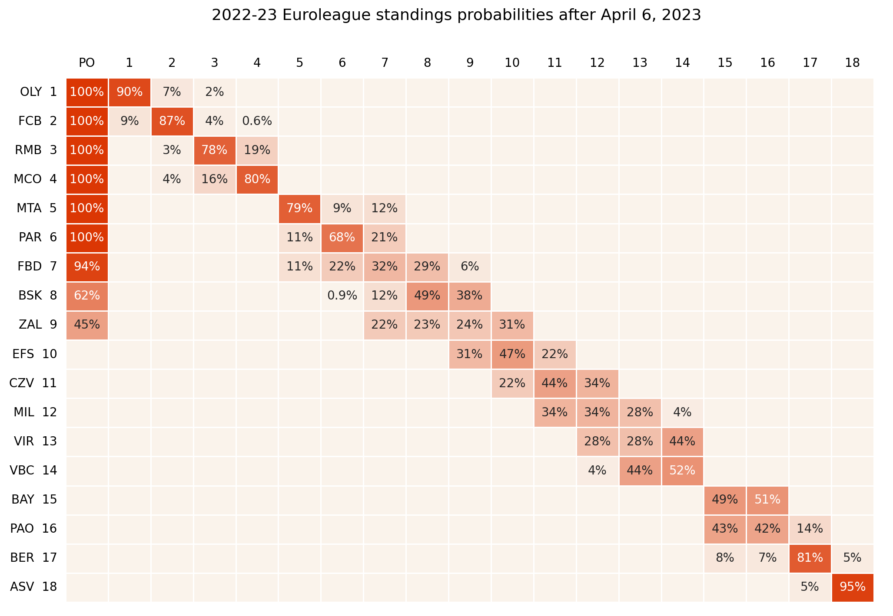

# Euroleague Season Simulator

This is a Python project that simulates the remainder of the games of the current Euroleague season based on the results of all the games played so far. 

The simulator uses a system similar to the one introduced by FiveThirtyEight to estimate each team’s current ELO rating. Then, using those ratings, it simulates each remaining game by estimating the margin of victory of the winning team based on the ELO difference between the two teams in the match (also accounting for home court advantage). The estimated margin of victory is sampled from the joint probability distribution of past games’ margin of victories and ELO differences. 

Once all the remaining games have been simulated, the final standings are computed by implementing Euroleague’s sorting and tiebreaking criteria in an efficient, vectorized way. The code runs 100K Monte Carlo simulations of seasons so that it can generate a table showing the probability of each team finishing in the Nth position at the end of the season.

Example output:

